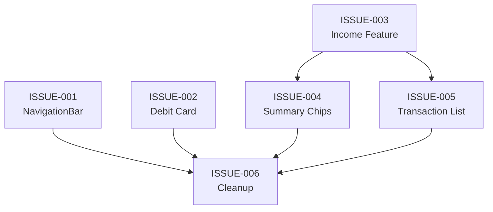

# Sprint 1 — Home UI Redesign & Income Feature

**Start Date:** TBD  
**Goal:** Redesign HomeScreen UI sesuai referensi, migrasi ke M3 NavigationBar, dan tambahkan fitur Income.

---

## Prinsip Development

Semua issue dalam sprint ini **wajib** mengikuti prinsip:

| Prinsip | Penerapan |
|---------|-----------|
| **Clean Architecture** | Perubahan data layer (Entity, DAO, Repository) terpisah dan teruji sebelum UI layer |
| **Clean Code** | Naming konsisten, single responsibility, no dead code |
| **KISS** | Solusi paling simpel yang solve the problem. Tidak over-engineer |
| **YAGNI** | Tidak menambah fitur/abstraksi yang belum dibutuhkan |

---

## Issue Tracker

| # | Issue | Priority | Type | Effort | Depends On |
|---|-------|----------|------|--------|------------|
| 001 | [NavigationBar](file:///c:/dame-project/Android/expense_tracker/.docs/issues/ISSUE-001-navigation-bar.md) | 🔴 High | UI Refactor | Medium | — |
| 002 | [Debit Card Balance](file:///c:/dame-project/Android/expense_tracker/.docs/issues/ISSUE-002-debit-card-balance.md) | 🔴 High | UI Redesign | Medium | — |
| 003 | [Income Feature](file:///c:/dame-project/Android/expense_tracker/.docs/issues/ISSUE-003-income-feature.md) | 🔴 High | Feature | Large | — |
| 004 | [Income/Expense Summary Chips](file:///c:/dame-project/Android/expense_tracker/.docs/issues/ISSUE-004-income-expense-summary-chips.md) | 🟡 Medium | UI Enhancement | Small | 003 |
| 005 | [Transaction List Item Update](file:///c:/dame-project/Android/expense_tracker/.docs/issues/ISSUE-005-transaction-list-item-update.md) | 🟡 Medium | UI Enhancement | Small | 003 |
| 006 | [HomeScreen Layout & Cleanup](file:///c:/dame-project/Android/expense_tracker/.docs/issues/ISSUE-006-homescreen-layout-cleanup.md) | 🟡 Medium | Cleanup | Small | 001-005 |

---

## Execution Order (Recommended)



**Phase 1 (Parallel):**
- ISSUE-001 — NavigationBar (independent)
- ISSUE-002 — Debit Card (independent)
- ISSUE-003 — Income Feature (independent, tapi paling besar)

**Phase 2 (Setelah ISSUE-003 selesai):**
- ISSUE-004 — Summary Chips
- ISSUE-005 — Transaction List Item Update

**Phase 3 (Setelah semua selesai):**
- ISSUE-006 — Integration & Cleanup

---

## Arsitektur Perubahan

```
┌─────────────────────────────────────────────────┐
│                   UI Layer                       │
│                                                  │
│  ┌──────────┐  ┌──────────┐  ┌──────────┐       │
│  │HomeScreen│  │InputScreen│  │SummaryScreen│    │
│  │(002,004, │  │  (003)    │  │           │      │
│  │ 005,006) │  │           │  │           │      │
│  └────┬─────┘  └────┬─────┘  └────┬──────┘      │
│       │              │             │              │
│  ┌────┴──────────────┴─────────────┴──────┐      │
│  │        NavigationBar (001)             │      │
│  └────────────────────────────────────────┘      │
│                                                  │
│  ┌────────────┐  ┌─────────────┐                 │
│  │HomeViewModel│ │InputViewModel│                │
│  │  (003,006) │  │   (003)     │                 │
│  └────┬───────┘  └─────┬───────┘                 │
├───────┼────────────────┼─────────────────────────┤
│       │   Data Layer   │                         │
│  ┌────┴────────────────┴──────┐                  │
│  │    Repository (003)        │                  │
│  └────────────┬───────────────┘                  │
│  ┌────────────┴───────────────┐                  │
│  │    DAO + Entity (003)      │                  │
│  └────────────┬───────────────┘                  │
│  ┌────────────┴───────────────┐                  │
│  │  AppDatabase + Migration   │                  │
│  │       (003)                │                  │
│  └────────────────────────────┘                  │
└─────────────────────────────────────────────────┘
```

---

## Files Impacted

| File | Issues |
|------|--------|
| `Expense.kt` | 003 |
| `ExpenseDao.kt` | 003 |
| `ExpenseRepository.kt` | 003 |
| `RoomExpenseRepository.kt` | 003 |
| `ExpenseWithCategory.kt` | 003, 005 |
| `AppDatabase.kt` | 003 |
| `InputScreen.kt` | 003 |
| `InputUiState.kt` | 003 |
| `InputViewModel.kt` | 003 |
| `InputRepository.kt` | 003 |
| `RoomInputRepository.kt` | 003 |
| `HomeScreen.kt` | 001, 002, 004, 005, 006 |
| `HomeUiState.kt` | 003, 006 |
| `HomeViewModel.kt` | 003, 006 |
| `MainActivity.kt` | 001 |
| `NavRoutes.kt` | 001 |
| `BottomNavBar.kt` (**NEW**) | 001 |
| `TransactionType.kt` (**NEW**) | 003 |
