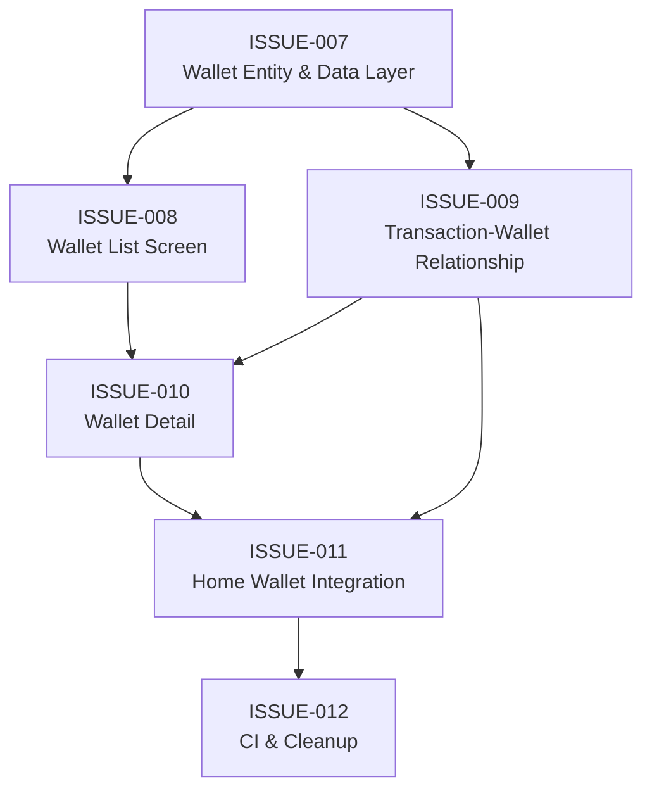

# Sprint 2 — Multi Wallet Feature

**Start Date:** TBD  
**Goal:** Menambahkan fitur Multi Wallet (Debit/Credit) sehingga user bisa mencatat transaksi pada wallet yang berbeda (misal: BCA, Mandiri, dll). Setiap wallet memiliki saldo dan riwayat transaksi tersendiri.

---

## Prinsip Development

Semua issue dalam sprint ini **wajib** mengikuti prinsip:

| Prinsip | Penerapan |
|---------|-----------|
| **Clean Architecture** | Entity, DAO, Repository terpisah dan teruji sebelum UI layer |
| **Clean Code** | Naming konsisten, single responsibility, no dead code |
| **KISS** | Solusi paling simpel yang solve the problem. Tidak over-engineer |
| **YAGNI** | Tidak menambah fitur/abstraksi yang belum dibutuhkan |
| **CI (GitHub Actions)** | Setiap issue harus lolos CI pipeline: build, test, lint |

---

## Issue Tracker

| # | Issue | Priority | Type | Effort | Depends On |
|---|-------|----------|------|--------|------------|
| 007 | [Wallet Entity & Data Layer](ISSUE-007-wallet-entity-data-layer.md) | 🔴 High | Feature (Data) | Large | — |
| 008 | [Wallet List Screen & Navigation](ISSUE-008-wallet-list-screen-navigation.md) | 🔴 High | Feature (UI) | Medium | 007 |
| 009 | [Transaction-Wallet Relationship](ISSUE-009-transaction-wallet-relationship.md) | 🔴 High | Feature (Data+UI) | Large | 007 |
| 010 | [Wallet Detail & Filtered Transactions](ISSUE-010-wallet-detail-filtered-transactions.md) | 🟡 Medium | Feature (UI) | Medium | 008, 009 |
| 011 | [Home Screen Wallet Integration](ISSUE-011-home-wallet-integration.md) | 🟡 Medium | Integration | Medium | 009, 010 |
| 012 | [CI Pipeline Enhancement & Final Cleanup](ISSUE-012-ci-pipeline-cleanup.md) | 🟡 Medium | Infra + Cleanup | Small | 007-011 |

---

## Execution Order (Recommended)



**Phase 1 (Foundation):**
- ISSUE-007 — Wallet Entity, DAO, Repository, Migration

**Phase 2 (Parallel, setelah 007 selesai):**
- ISSUE-008 — Wallet List Screen + Navbar Item
- ISSUE-009 — Menghubungkan transaksi ke wallet (migration, DAO, UI update)

**Phase 3 (Setelah 008 & 009 selesai):**
- ISSUE-010 — Wallet Detail Screen (transaksi per-wallet)

**Phase 4 (Integration):**
- ISSUE-011 — Home Screen menampilkan wallet aktif

**Phase 5 (Final):**
- ISSUE-012 — CI pipeline enhancement & final cleanup

---

## Arsitektur Perubahan

```
┌─────────────────────────────────────────────────────┐
│                     UI Layer                         │
│                                                      │
│  ┌──────────┐  ┌───────────┐  ┌───────────────────┐ │
│  │HomeScreen│  │WalletList │  │WalletDetailScreen │ │
│  │  (011)   │  │  (008)    │  │     (010)         │ │
│  └────┬─────┘  └────┬──────┘  └────┬──────────────┘ │
│       │              │              │                │
│  ┌────┴──────────────┴──────────────┴──────┐        │
│  │     NavigationBar + Wallet Tab (008)    │        │
│  └─────────────────────────────────────────┘        │
│                                                      │
│  ┌─────────────┐  ┌──────────────┐                  │
│  │WalletVM(008)│  │HomeVM (011)  │                  │
│  └──────┬──────┘  └──────┬───────┘                  │
├─────────┼────────────────┼──────────────────────────┤
│         │   Data Layer   │                           │
│  ┌──────┴────────────────┴───────┐                  │
│  │   WalletRepository (007)      │                  │
│  │   ExpenseRepository (009)     │                  │
│  └───────────┬───────────────────┘                  │
│  ┌───────────┴───────────────────┐                  │
│  │  WalletDao + ExpenseDao       │                  │
│  │     (007, 009)                │                  │
│  └───────────┬───────────────────┘                  │
│  ┌───────────┴───────────────────┐                  │
│  │  AppDatabase + Migration v3→4 │                  │
│  │     (007, 009)                │                  │
│  └───────────────────────────────┘                  │
└─────────────────────────────────────────────────────┘
```

---

## Files Impacted

| File | Issues |
|------|--------|
| `Wallet.kt` (**NEW**) | 007 |
| `WalletDao.kt` (**NEW**) | 007 |
| `WalletRepository.kt` (**NEW**) | 007 |
| `RoomWalletRepository.kt` (**NEW**) | 007 |
| `AppDatabase.kt` | 007, 009 |
| `Expense.kt` | 009 |
| `ExpenseDao.kt` | 009 |
| `ExpenseRepository.kt` | 009 |
| `RoomExpenseRepository.kt` | 009 |
| `ExpenseWithCategory.kt` | 009 |
| `WalletListScreen.kt` (**NEW**) | 008 |
| `WalletViewModel.kt` (**NEW**) | 008 |
| `WalletUiState.kt` (**NEW**) | 008 |
| `WalletDetailScreen.kt` (**NEW**) | 010 |
| `BottomNavBar.kt` | 008 |
| `NavRoutes.kt` | 008, 010 |
| `MainActivity.kt` | 008, 010, 011 |
| `HomeScreen.kt` | 011 |
| `HomeViewModel.kt` | 011 |
| `HomeUiState.kt` | 011 |
| `InputScreen.kt` | 009 |
| `InputViewModel.kt` | 009 |
| `InputUiState.kt` | 009 |
| `.github/workflows/ci.yml` | 012 |
